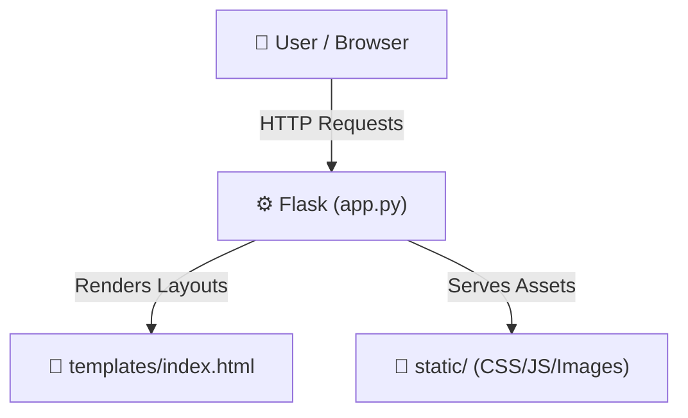

# FaceAttend-AI-Landing-Page

> A Flask-based landing page for the FaceAttend-AI system.

[](https://github.com/codedbydevansh/FaceAttend-AI-Landing-Page/stargazers) 
[](https://github.com/codedbydevansh/FaceAttend-AI-Landing-Page/network/members) 
[](https://github.com/codedbydevansh/FaceAttend-AI-Landing-Page/issues) 
[](https://github.com/codedbydevansh/FaceAttend-AI-Landing-Page/commits/main) 
[](https://flask.palletsprojects.com/) 
[](https://www.python.org/)

---

## 📑 Table of Contents

- [Description](#-description)
- [Key Features](#-key-features)
- [Use Cases](#-use-cases)
- [Screenshots](#-screenshots)
- [Tech Stack](#-tech-stack)
- [Architecture](#-architecture)
- [Quick Start](#-quick-start)
- [Key Dependencies](#-key-dependencies)
- [Project Structure](#-project-structure)
- [Development Setup](#-development-setup)
- [Contributors](#-contributors)
- [Contributing](#-contributing)
- [License](#-license)

---

## 📝 Description

**FaceAttend-AI-Landing-Page** is a lightweight, Flask-powered web application designed to serve as the landing page for the FaceAttend-AI project. It provides a clean, highly scannable entry point to present the face recognition attendance system to users, leveraging Python's micro-framework to manage routing and server-side rendering.

The application is structured around a single-route Flask configuration in `app.py` that dynamically serves the homepage template. It separates frontend assets and layouts by utilizing standard Flask directories, managing styling and interactive components through dedicated `static` and `templates` directories.

---

## ✨ Key Features

- **🐍 Flask-Powered Routing** — Uses Python's lightweight Flask micro-framework to handle web routing and render client-facing templates.
- **🗂️ Structured Directory Architecture** — Organizes UI layouts and assets into distinct templates and static folders to keep source files modular.
- **⚙️ Local Development Configuration** — Runs on port `5002` with debug mode enabled to facilitate rapid feedback during local interface updates.

---

## 🎯 Use Cases

- Serving as the introductory web portal and promotional landing page for the FaceAttend-AI application.
- Providing a lightweight boilerplate for deploying a simple, Python-backed single-page informational website.

---

## 📸 Screenshots

### 🌐 Portal Overview

#### Landing Page


### 🎓 Student Portal Workflow

#### 1. Student Login


#### 2. Student Enrollment


#### 3. Student Dashboard


#### Portal Interface


### 🏫 Teacher Portal Workflow

#### 1. Teacher Login


---

## 🛠️ Tech Stack

- **Backend:** [Flask](https://flask.palletsprojects.com/) (Python micro-framework)
- **Language:** [Python](https://www.python.org/)
- **Frontend:** HTML5, CSS3, JavaScript

---

## 🏗️ Architecture

A high-level view of the communication flow:



---

## ⚡ Quick Start

Follow these steps to get the landing page up and running locally:

### 1. Clone the repository
```bash
git clone https://github.com/codedbydevansh/FaceAttend-AI-Landing-Page.git
cd FaceAttend-AI-Landing-Page
```

### 2. Create & activate a virtual environment
```bash
# macOS/Linux
python -m venv venv && source venv/bin/activate

# Windows
python -m venv venv
venv\Scripts\activate
```

### 3. Install dependencies
```bash
pip install -r requirements.txt
```

### 4. Run the Flask app
```bash
# Start the application on default port
flask run

# Note: To run specifically on port 5002 as configured for development:
# flask run --port=5002
```

---

## 📦 Key Dependencies

- `flask` (latest standard version compatible with the application routing layout)

---

## 📁 Project Structure

```text
.
├── app.py
├── requirements.txt
├── static
│   ├── css
│   │   └── style.css
│   ├── img
│   │   ├── app_logo.png
│   │   ├── demo
│   │   │   ├── snap-landing.png
│   │   │   ├── snap-student-flow-1-login.png
│   │   │   ├── snap-student-flow-2-enroll.png
│   │   │   ├── snap-student-flow-3-dashboard.png
│   │   │   ├── snap-student.png
│   │   │   ├── snap-teacher-flow-1-login.png
│   │   │   ├── snap-teacher-flow-2-dashboard.png
│   │   │   ├── snap-teacher-flow-3-create-course.png
│   │   │   ├── snap-teacher-flow-4-share-qr-or-link.png
│   │   │   ├── snap-teacher-flow-5-see-stored-records.png
│   │   │   ├── snap-teacher-flow-5.1-voice-attendance.png
│   │   │   ├── snap-teacher-flow-5.2-photo-attendance.png
│   │   │   └── snap-teacher.png
│   │   └── logo.png
│   └── js
│       └── script.js
└── templates
    └── index.html
```

---

## 🛠️ Development Setup

### Prerequisites
- Python (v3.10+ recommended)

### Step-by-Step Configuration
1. Prepare the environment:
   ```bash
   python -m venv venv
   ```
2. Activate the environment:
   - **macOS/Linux:** `source venv/bin/activate`
   - **Windows:** `venv\Scripts\activate`
3. Install dependencies:
   ```bash
   pip install -r requirements.txt
   ```

---

## 👥 Contributors

Thanks to everyone who has contributed to this project:

<p align="left">
<a href="https://github.com/codedbydevansh" title="codedbydevansh"><img src="https://avatars.githubusercontent.com/u/155902353?v=4&s=64" width="64" height=